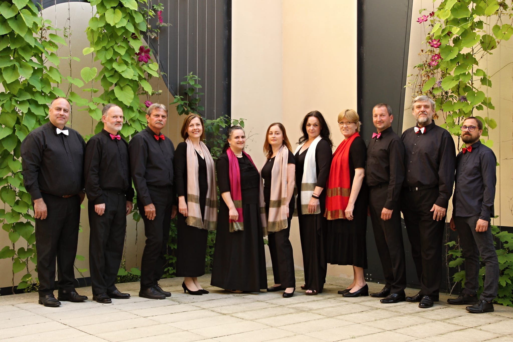
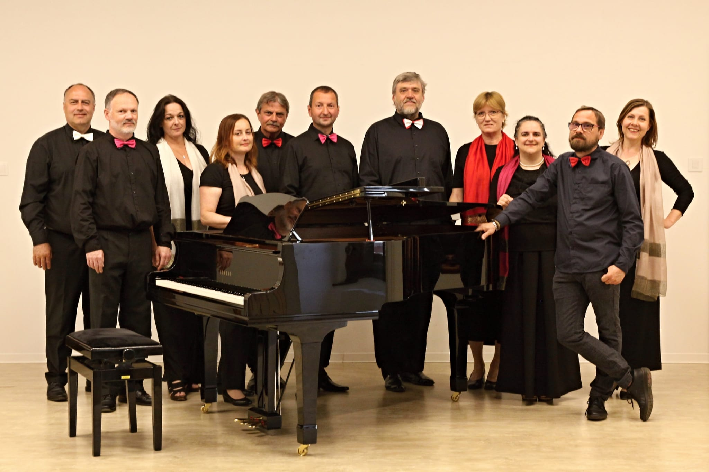
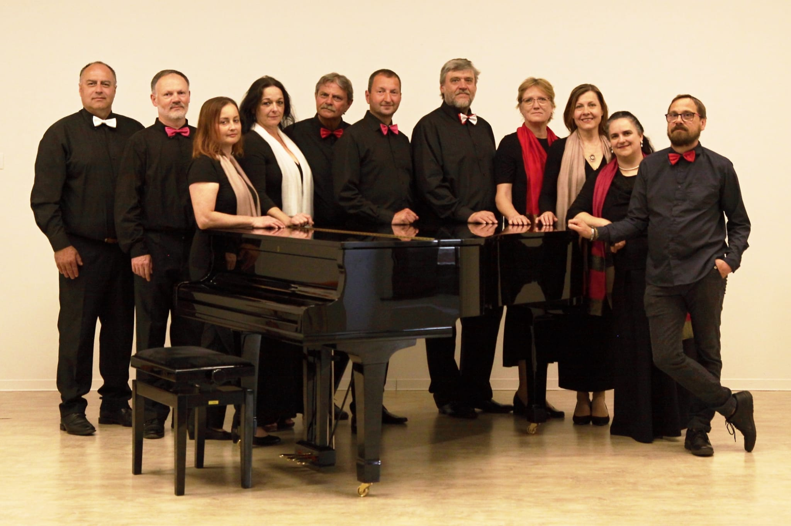
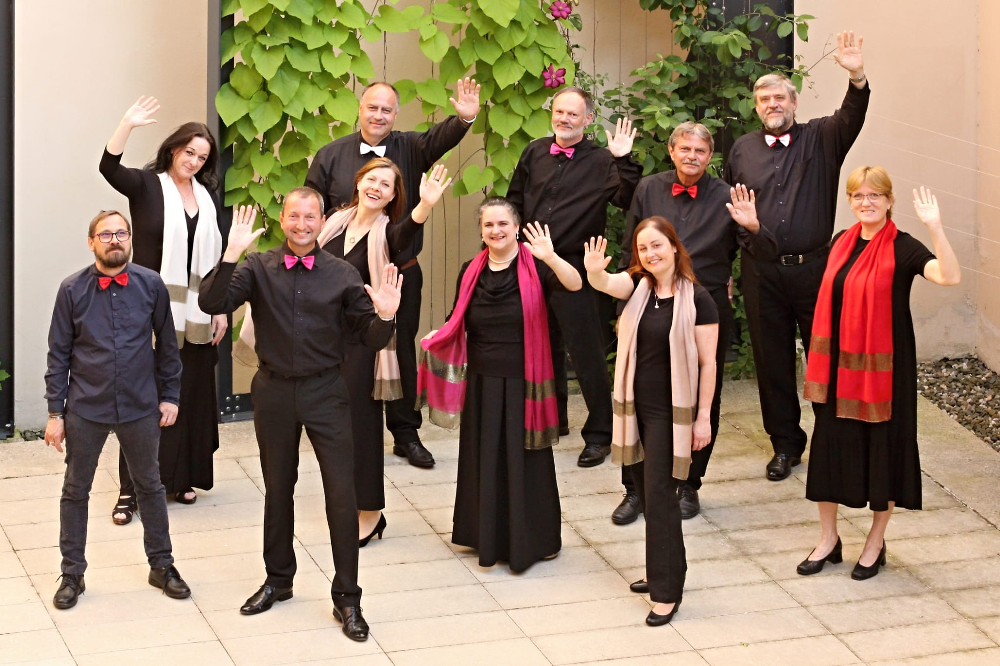
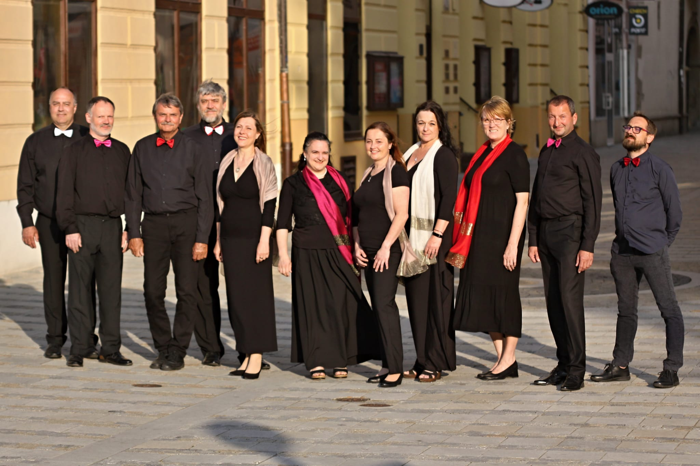
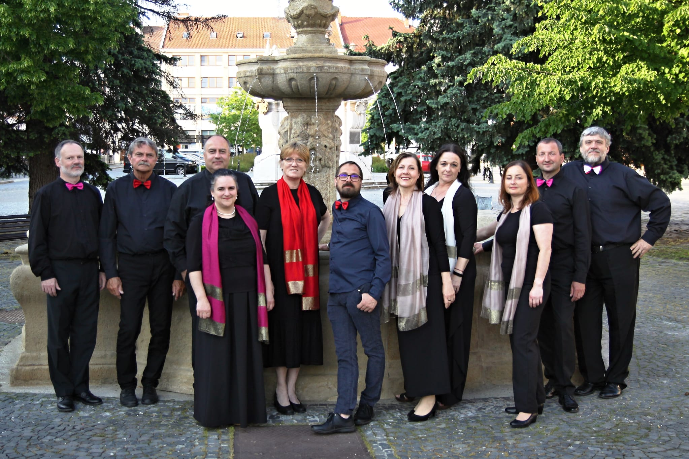

# Kdo jsme

**Chorus Castelli** je smíšený komorní sbor působící při ZUŠ Uh. Hradiště.

Malý smíšený pěvecký sbor byl založen v roce 2015 skupinkou nadšených zpěváků, kteří se celý život věnují sborovému zpěvu.
Sbor působí při ZUŠ Uherské Hradiště, můžeme se s ním setkat na akcích typu Noc kostelů, a to nejen v Uherském Hradišti, ale i v Kroměříži, Olomouci, na Velehradě a v dalších městech. \
Vystupoval rovněž při předávání cen města Uherské Hradiště a účinkoval v různých městech i při slavnostních liturgiích.

V jeho repertoáru najdeme převážně barokní a renesanční vokální skladby, a to církevní i světské. Nevyhýbá se ani duchovním písním od současných autorů. \
Sbor zpívá a capella, tedy samostatně bez hudebního doprovodu

**Umělecký vedoucí:** Mgr. Jakub Macek

